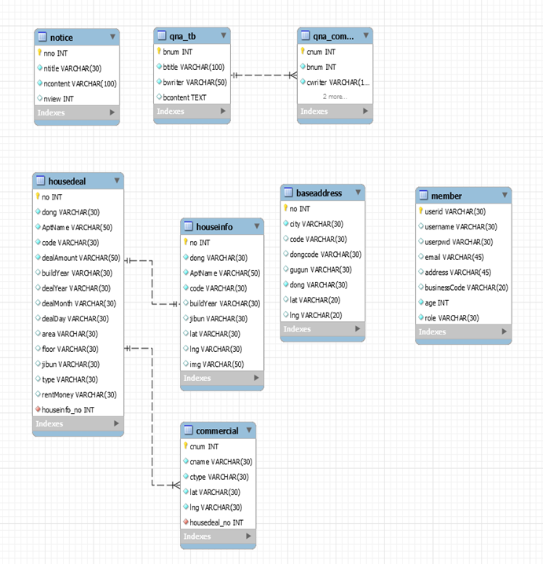

 

# 야 다방 어때?

### 1. **기획**

**1.1** **설계 의도**

‘집을 사기 전에 미리 살아보면서 주변의 환경을 알 수 있었으면 좋겠다’라는 취지로 웹 사이트들이나 어플들을 찾아보면 한가지 기능만 있는 경우가 대부분이다. 이에 대전 5반 5조는 매매와 숙박, 두 기능을 합친 ‘야 다방 어때?’라는 웹사이트를 만들어보았다.

 **1.2** **개발 일정**

|             | 1일차                              | 2일차                          | 3일차    | 4일차    | 5일차         | 6일차      |
| ----------- | ---------------------------------- | ------------------------------ | -------- | -------- | ------------- | ---------- |
| 기획        | DB설계& 계획 작성                  |                                |          |          |               |            |
| 메인 페이지 | Vue 파일작성 & 기초 REST 서버 구축 |                                |          | 날씨보기 |               | 공지사항   |
| 회원관리    |                                    | 로그인/로그아웃                | 회원정보 |          | Interceptor   |            |
| 커뮤니티    |                                    |                                | 공지사항 | QnA      | 여행코스 정보 | 페이징처리 |
| 매매정보    |                                    | 매매 목록 보기& 매매 상세 보기 |          |          | CSS수정       | 지도수정   |
| 숙박정보    |                                    |                                | 숙박목록 | 숙박상세 | 숙박 예매     | 지도수정   |

### 2. 요구 사항

**2.1 구현 기능**

| 구현 목록       | 구현 기능 설명                                               |
| --------------- | ------------------------------------------------------------ |
| 메인 페이지     | 좌측에는 실시간 날씨 API를 사용해서 해당 지역 날씨를 보여주고 지역 검색기능을 통해 원하는 지역의 날씨 검색도 가능하다. 우측에는 공지사항 게시판을 띄우고 게시글 제목을 누르면 해당 글을 볼 수 있다. |
| 로그인/로그아웃 | 회원 로그인은 JWT를 통해 회원이 확인된다면 인증 토큰을 발행한다. JWT에서는  토큰발행과 해당 토큰의 사용자 정보를 같이 담고 있어서 로그아웃시, 프론트에서는 store에 저장한 정보를 초기화하고 Backend에는 정보가 남아있지만  토큰의 유효 시간이 지나면 만료한다. |
| 회원 관리       | 회원 가입시에는 모든 항목을 입력해야  되며 가입을 할 때 일반 사용자와 사업자를 구분해서 가입한다.     회원 페이지가 처음 로드 될 시 인증  토큰이 있다면 Backend에서 토큰을 이용하여 해당 사용자를 얻어온다. 하지만 토큰 정보가 없다면 Interceptor에서 접근을 막고  로그인 페이지로 보낸다. 그 후 확인용 비밀번호가 입력되면 로드 될 때 받아온 사용자의 비밀번호와  맞는지 확인하고 정보를 보여준다. |
| 공지사항        | 모든 사람이 볼 수 있고 글을 볼 때마다  해당 글의 조회수가 증가한다. 공지사항 등록, 수정, 삭제는 관리자만이 할 수 있으며 일반 사용자에게는 해당 버튼이 보이지 않는다. |
| QnA             | 회원만이 글을 작성할 수 있고 댓글을  쓸 수 있다. 글은 작성한 사람만이 수정, 삭제할 수  있다. |
| 여행 정보       | 한국관광공사의 오픈 API를 사용해서 지역별 여행 코스 정보를 띄우고 코스를 클릭하면 해당 코스의 자세한 설명과 거리, 소요시간이 나타난다. 그 밑에는 위치를 카카오 맵을 이용하여  나타냈다. |
| 매매 정보       | 처음에는 매매 목록과 검색이 나타나고  검색을 통해 자신이 원하는 건물만을 볼 수 있다. 매물을 클릭하면 해당 건물의 상세 정보와 건물  주변의 상권 정보가 나타난다. 카페와 편의점의 경우 아이콘을 이용해서 나타냈다. |
| 숙박 정보       | 한국관광공사의 오픈 API를 사용하여 지역별 숙박 정보를 나타냈다. 숙박 목록 중 하나를  클릭하면 해당 숙박의 상세 정보와 위치, 구비된 시설 등을 알 수 있고 날짜와 인원수를 선택하여  예매할 수 있다. |

 

**2.2** **구현 기술**

**Backend**

\- 사용 언어: JAVA

\- 프레임워크: Spring Boot, MyBatis, JWT, Maven, MySQL

\- 서버: Tomcat 9.0

**Frontend**

\- 프레임워크: Vue.js, BootStrap 4.0

**기타**

\- 협업툴: Notion

  

### 3. 요구 설계

**3.1** **아키텍쳐 구조**

****

 

**3.2** **클래스 다이어그램**

 

​    

​    

 

**3.3** **데이터 베이스 설계**

 

 

### 4. 구현상세

**4.1** **화면 설계**

**(1)** **메인 페이지**

 

**(2)** **로그인 페이지**

 

**(3)** **마이페이지**

**(4)** **공지사항 페이지**

**공지사항 글 리스트**

**공지사항 글읽기**

 

**공지사항 등록(관리자 전용)**

**(5) Q&A** **게시판**

**Q&A** **글 리스트**

 

**Q&A** **글 읽기**

**Q&A** **글쓰기**

**(6)** **여행 정보 페이지**

 **여행 정보 리스트**

**코스 정보 (1)**

**코스 정보(2)**

 

**코스 정보(3)**

**(7)** **매물 정보 페이지**

**매물 정보 리스트**

**매물 정보 상세**

 

**(8)** **숙박 정보**

 **숙박 정보 리스트**

**숙박 정보 상세(1)**

 **숙박 정보 상세(2)**

 